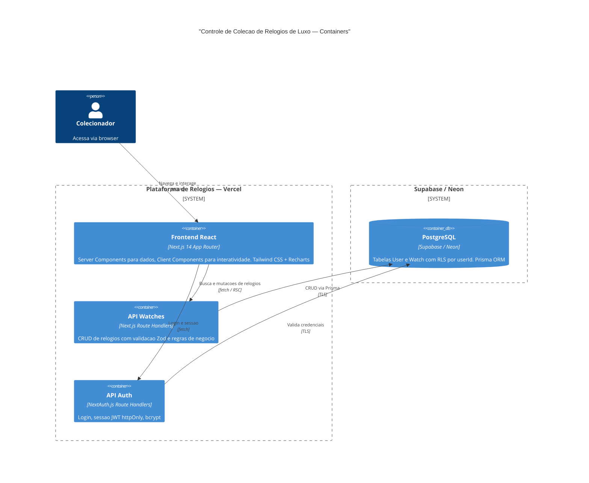

# C4 — Nível 2: Containers

```mermaid
C4Container
  title "Controle de Colecao de Relogios de Luxo — Containers"

  Person(colecionador, "Colecionador", "Acessa via browser")

  System_Boundary(app_boundary, "Plataforma de Relogios — Vercel") {
    Container(frontend, "Frontend React", "Next.js 14 App Router", "Server Components para dados, Client Components para interatividade. Tailwind CSS + Recharts")
    Container(api_watches, "API Watches", "Next.js Route Handlers", "CRUD de relogios com validacao Zod e regras de negocio")
    Container(api_auth, "API Auth", "NextAuth.js Route Handlers", "Login, sessao JWT httpOnly, bcrypt")
  }

  System_Boundary(db_boundary, "Supabase / Neon") {
    ContainerDb(postgres, "PostgreSQL", "Supabase / Neon", "Tabelas User e Watch com RLS por userId. Prisma ORM")
  }

  Rel(colecionador, frontend, "Navega e interage", "HTTPS")
  Rel(frontend, api_watches, "Busca e mutacoes de relogios", "fetch / RSC")
  Rel(frontend, api_auth, "Login e sessao", "fetch")
  Rel(api_watches, postgres, "CRUD via Prisma", "TLS")
  Rel(api_auth, postgres, "Valida credenciais", "TLS")
```
