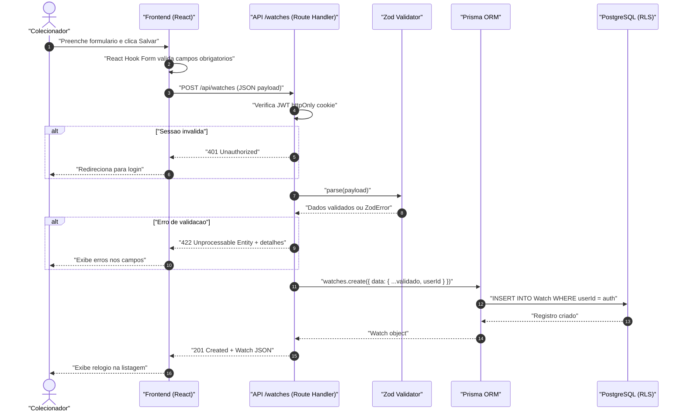

# Sequência — Cadastro de Relógio (Fluxo Principal)

```mermaid
sequenceDiagram
  autonumber
  actor C as "Colecionador"
  participant FE as "Frontend (React)"
  participant API as "API /watches (Route Handler)"
  participant ZOD as "Zod Validator"
  participant PRI as "Prisma ORM"
  participant DB as "PostgreSQL (RLS)"

  C->>FE: "Preenche formulario e clica Salvar"
  FE->>FE: "React Hook Form valida campos obrigatorios"
  FE->>API: "POST /api/watches (JSON payload)"
  API->>API: "Verifica JWT httpOnly cookie"
  alt "Sessao invalida"
    API-->>FE: "401 Unauthorized"
    FE-->>C: "Redireciona para login"
  end
  API->>ZOD: "parse(payload)"
  ZOD-->>API: "Dados validados ou ZodError"
  alt "Erro de validacao"
    API-->>FE: "422 Unprocessable Entity + detalhes"
    FE-->>C: "Exibe erros nos campos"
  end
  API->>PRI: "watches.create({ data: { ...validado, userId } })"
  PRI->>DB: "INSERT INTO Watch WHERE userId = auth"
  DB-->>PRI: "Registro criado"
  PRI-->>API: "Watch object"
  API-->>FE: "201 Created + Watch JSON"
  FE-->>C: "Exibe relogio na listagem"
```
